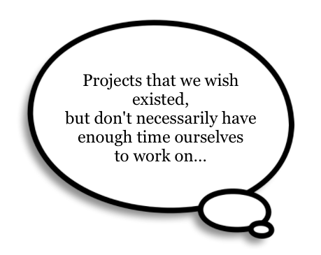

# The Hypothesis Project

  

If you spend most of your time building things, you've probably appreciate that solving the **right** problem matters an awful lot.

You probably also see a bunch of places where a nice tool would really help out - and maybe you don't have the time and/or expertise needed to make it happen yourself. Or maybe, you're like me and looking for some places to use your skills to make the world a better plan (tm).

Inspired by Tom Preston-Werner (see below), here is a collection of "Hypothesis lists" - projects that we wish existed, but don't necessarily have enough time
ourselves to work on.

We encourage you to submit a list - ideally in the form of a link to markdown, google doc, &c. &c - and (optionally) a brief biography if you're interested in people chatting to you. The more you can explain about **why** this is a good project or a worth problem to solve, the better.

Thank you!

## How This Works

## Help

Here's [a nice guide to markdown](https://github.com/adam-p/markdown-here/wiki/Markdown-Cheatsheet).

# Inspiration

> _"We also have a program that's part of Preston-Warner Ventures called Hypothesis, which is a
> place where we fund projects that we wish existed, but don't necessarily have enough time
> ourselves to work on."_

_see:_
[Software Engineering Daily Interview transcript](https://softwareengineeringdaily.com/wp-content/uploads/2020/05/SED1075-Redwood.pdf) that mentions Tom Preston-Werner's Hypothesis projects.

[Extract with more detail is here](inspiration.md)

# Sponsors

(not really sponsored by but the logo is cool - and we are looking for people to help us spread the news!)

